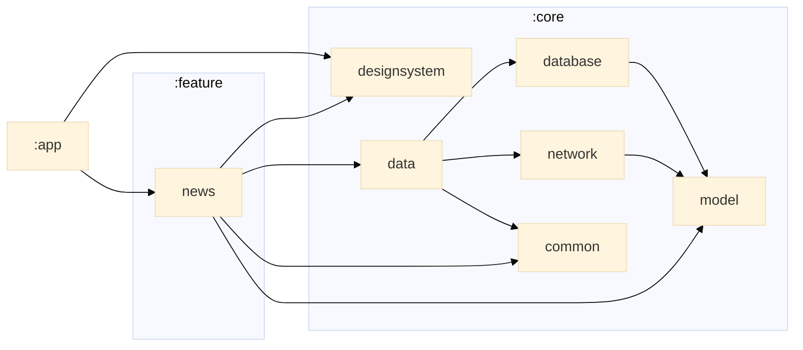

## Types of modules in MillieApp

```mermaid
%%{
  init: {
    'theme': 'base'
  }
}%%

graph LR
  subgraph :core
    :core:designsystem["designsystem"]
    :core:database["database"]
    :core:model["model"]
    :core:network["network"]
    :core:data["data"]
    :core:common["common"]
  end
  subgraph :feature
    :feature:news["news"]
  end
  :app --> :feature:news
  :app --> :core:designsystem
  :core:database --> :core:model
  :core:network --> :core:model
  :core:data --> :core:common
  :core:data --> :core:network
  :core:data --> :core:database
  :feature:news --> :core:model
  :feature:news --> :core:designsystem
  :feature:news --> :core:data
  :feature:news --> :core:common
```